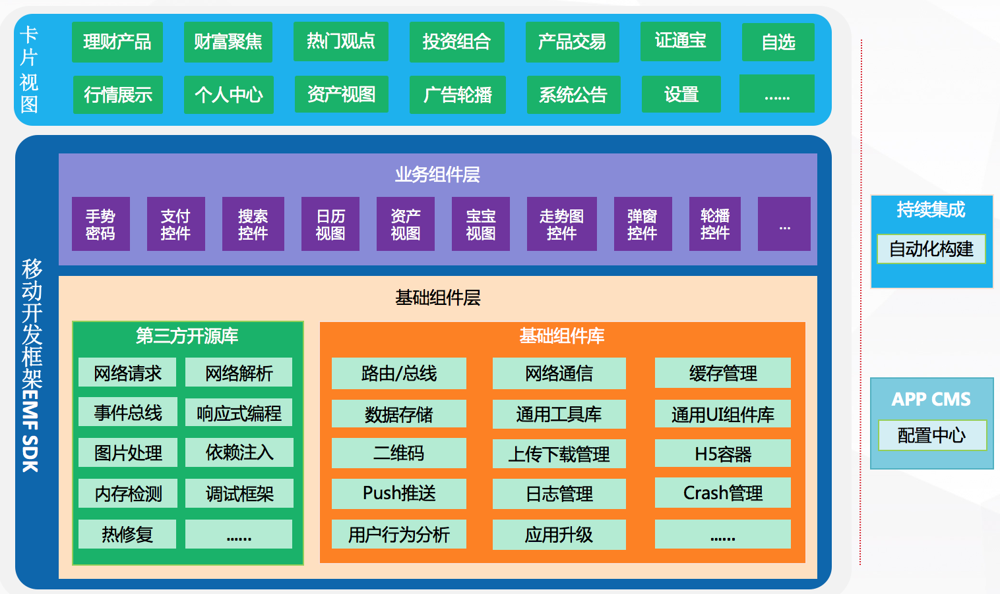

## 1.概述
### 1.1. 目的
移动开发框架EMF（Extreme Mobile Framework）是集移动互联网行业的优秀实践，聚焦金融领域的行业特性，提供一个能适应快速迭代，系统稳定的移动应用开发基础环境。

  
### 1.2. 参考文档
1. 《Android开发规范》
2. 《iOS开发规范》

   
  
## 2.系统架构

### 2.1. 系统架构
  
业务模块层  

1. 每块业务对应一个单独的模块  
2. 模块充分解藕，不相互依赖  
3. 模块的通讯和跳转通过 服务总线 来实现  
业务组件层  

1. 组件跟业务相关联  
2. 单一业务组件只能对应某一项具体的业务  
3. 业务模块层的业务功能模块可以逐步下放到业务组件层  

基础组件层  

1. 业务无关的各种组件  
2. 业务无关的各种UI Widget  
3. 各种第三方开源库  
持续集成  

1. 自动化构建  
2. 自动化测试  

###2.2.  工程目录结构说明
    app - 宿主工程，包括启动页和首页等
    ect_lib - 公共模块，公共库，主要有各种`base`，各种ui组件，自定义组件，
              公用的`Activity`、公用的`Fragment`，和公用的`utils`等等
    mod_xx - 功能模块，只依赖ect_lib，mod_xx间不相互依赖，使用路由进行通讯
        activity -- 存放activity
        fragment -- 存放fragment
        adapter  -- 存放adapter
        service  -- 存放服务类
        receiver -- 存放广播服务类
        api      -- 存放网络请求接口api
        beans    -- 存放实体类
        utils    -- 存放工具类，优先使用ect_lib/utils下的工具类
        widgets  -- 存放自定义view
    ect_annotation - java模块，编译时所需的注解
    ect_processor - java模块，编译时自动生成代码
         
    说明：  
    1.mod_xx间不相互依赖
        使用路由进行通讯
    2.采用MVVM Databinding模式开发  
          [Databinding参考](https://www.jianshu.com/p/dd247d6a562d)   
    3.mod_xx可独立编译
        在各模块下，修改gradle.properties文件中的isModule=true，执行模块的assembleDebug
        
  
### 2.3. 第三方帐号清单  

1. Bugly :  崩溃日志收集和热修复， 需提供Bugly上注册的APP_ID
2. 小米推送 :  小米推送服务，需提供小米上注册的APP_ID和APP_KEY
3. 友盟＋ :  友盟用户行为分析统计，需提供友盟上注册的UMENG_APPKEY和UMENG_CHANNEL
4. 证通行为分析 :  证通行为分析统计，需提供证通上注册的SLIA_APP_KEY、SLIA_PWD和 SLIA_SALT

＊帐号配置参照BuildVariants.java的定义说明

