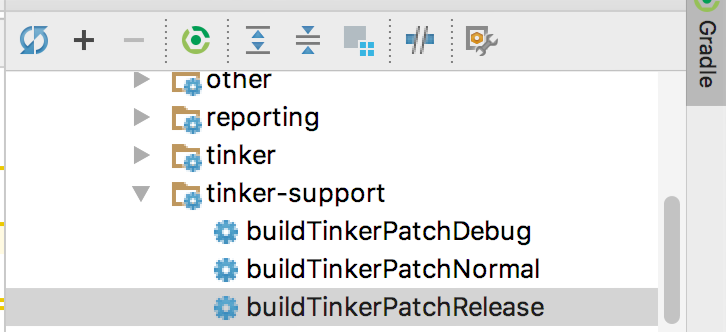

## <a name="hotfix"></a>热修复
EMF集成了bugly-thinker热修复管理。
Tinker 是微信官方的 Android 热补丁解决方案，它支持动态下发代码、So 库以及资源，让应用能够在不需要重新安装的情况下实现更新。支持类替换，so替换，资源替换。  
使用时需要在Bugly注册APP信息。可参照[Bugly Android热更新使用指南](https://bugly.qq.com/docs/user-guide/instruction-manual-android-hotfix/?v=20170912151050)。

使用方法  
1.修复缺陷代码

2.指定Base版本文件  
  修改app/tinker-support.gradle文件  

```
//修改此处的路径
def baseApkDir = "app-0908-14-10-27"  

//修改此处apk文件名
baseApk =  "${bakPath}/${baseApkDir}/app_release.apk" 

//修改此处map文件名
baseApkProguardMapping = "${bakPath}/${baseApkDir}/app-release-mapping.txt" 

//修改此处R文件名
baseApkResourceMapping = "${bakPath}/${baseApkDir}/app-release-R.txt"  
```  

3.编译Patch包  
执行Gradle的tinker-support下buildTinkerPatchRelease任务  
  

4.上传Patch到Bugly平台  

5.Patch验证  
启动APP，在Debug模式下，能看到Patch的版本信息，如下日志： 

```
CrashReport: app version is: [1.0.0-debug.1709080], [deviceId:null|null|e55dbb9d7f12f574], channel: [null], base tinkerId:[v1.0.0_1709080_b3732c9_1504851027571_base], patch tinkerId:[v1.0.0_1709080_b3732c9_1504852382290_patch], patch version:[1]
```