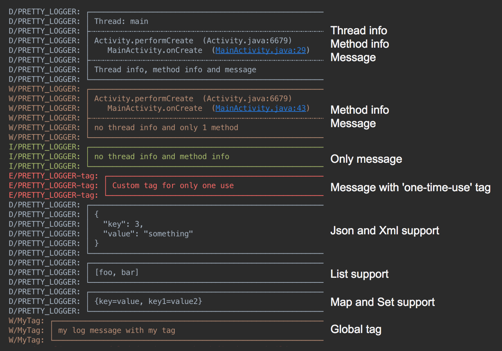

## <a name="logger"></a>统一日志管理
EMF统一使用[Logger](https://github.com/orhanobut/logger)日志工具类，实现日志的统一管理。弥补了“android的logcat的message有字符长度的限制,超过将直接截断”的缺陷。  
Logger提供：   
1. 线程信息：log在哪个线程  
2. 类信息：log在哪个类  
3. 方法信息：log在哪个方法的哪一行  
4. 支持直接打印List，Set，Map，数组类型等引用类型  
5. 漂亮地打印json  
6. 漂亮的打印XML  
7. 漂亮的换行分割  
8. 整洁的输出  
9. 跳转到源代码  


典型应用

```
 Logger.d("debug");  
 
 //支持参数添加占位符来格式化字符串
 Logger.d("hello %s", "world"); 
 
 //Collections support (only available for debug logs)
 Logger.d(MAP);
 Logger.d(SET);
 Logger.d(LIST);
 Logger.d(ARRAY);
 
 //Json and Xml support (output will be in debug level)
 Logger.json(JSON_CONTENT);
 Logger.xml(XML_CONTENT);
```

设置Log输出级别

```
Logger.addLogAdapter(new AndroidLogAdapter() {
  @Override public boolean isLoggable(int priority, String tag) {
    return BuildConfig.DEBUG;
  }
});
```

保存到文件

```
Logger.addLogAdapter(new DiskLogAdapter());
```

日志输出格式
 